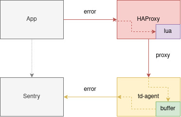

# Транспортировка событий в Sentry через HAProxy + td-agent



Схема работы:
* Приложение отправляет сформированный для `Sentry` запрос на `HAProxy`
* `HAProxy` преобразовывает в понятные данные для `td-agent` при помощи `lua скрипта`
* `td-agent` преобразовывает в понятные данные для `Sentry` и отправлет в `Sentry` если сервер доступен, иначе буферизирует на диск и ждет доступности


## Запуск и тестирование

Запуск инфраструктуры:
```bash
export SENTRY_ADDR="https://sentry.domain:port"
docker compose up
```

Теперь `HAProxy` доступен по адресу `localhost:9999` а `td-agent` на `localhost:9888`.

### store endpoint

Объявим переменные проекта и ключа:
```bash
PROJECT_ID=0
SENTRY_KEY=""
```

Отправка события без сжатия:
```bash
curl -v \
    -d '{"exception":{"values":[{"type":"Test issue","value":"store"}]}}' \
    -H 'Content-type: application/json' \
    -H "X-Sentry-Auth: Sentry sentry_version=7, sentry_client=td-agent, sentry_key=$SENTRY_KEY" \
    http://localhost:9999/api/$PROJECT_ID/store/
```

Отправка события со сжатием:
```bash
PROJECT_ID=0
echo '{"exception":{"values":[{"type":"Test issue","value":"store"}]}}' | gzip > json.gz
curl -v \
    --data-binary @json.gz \
    -H "Content-Encoding: gzip" \
    -H 'Content-type: application/json' \
    -H "X-Sentry-Auth: Sentry sentry_version=7, sentry_client=td-agent, sentry_key=$SENTRY_KEY" \
    http://localhost:9999/api/$PROJECT_ID/store/
```

### envelope endpoint

Объявим переменные проекта и ключа:
```bash
PROJECT_ID=0
SENTRY_KEY=""
```

Готовим тело запроса:
```bash
echo '{"sdk":{"name":"sentry.javascript.vue","version":"7.54.0"},"trace":{"environment":"test"}}' > body.json
echo '{"type":"event"}' >> body.json
echo '{"exception":{"values":[{"type":"Test issue","value":"envelope"}]}}' >> body.json
```

Отправка `envelope`:
```bash
curl -v \
  -H 'Content-type: text/plain' \
  --data-binary @body.json \
  "http://localhost:9999/api/$PROJECT_ID/envelope/?sentry_key=$SENTRY_KEY&sentry_version=7"
```

Отправка через `envelope` через [tunnel](https://docs.sentry.io/platforms/javascript/troubleshooting/#dealing-with-ad-blockers)
```bash
curl -v \
  -H 'Content-type: text/plain' \
  --data-binary @body.json \
  "http://localhost:9999/api/$PROJECT_ID/envelope/$SENTRY_KEY/"
```
